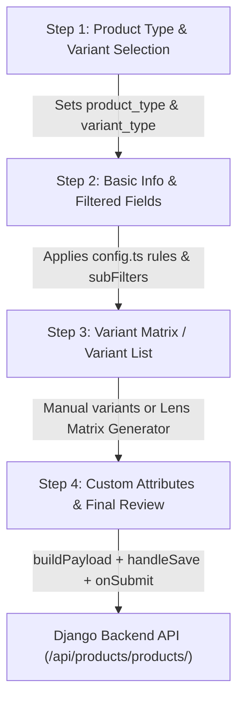

# Product Application Logic Review & Audit Plan

This document outlines a step-by-step review and audit of the Frontend Product Creation & Editing workflow. It details how Product Types (`FR`, `SL`, `CL`, `DV`, `AX`, `OT`), Variant Types (`frames`, `stockLenses`, `rxLenses`, `contactLenses`, `basic`), field filtering rules, dynamic foreign keys, and submission payloads are structured and processed.

---

## Architecture Overview & Data Flow

---

## Step-by-Step Logic Breakdown & Review

### Step 1: Product Type & Variant Selection (`ProductTypeStep.tsx`)

#### 1. Product Type Choices (`PRODUCT_TYPE_CHOICES`)
* **`FR` (Frames / إطارات)**: Eyeglasses and Sunglasses.
* **`SL` (Spectacle Lens / عدسات طبية/نظارات)**: Ophthalmic stock or Rx lenses.
* **`CL` (Contact Lens / عدسات لاصقة)**: Soft, rigid, colored, or power contact lenses.
* **`DV` (Devices / أجهزة)**: Diagnostic, optical equipment, tools.
* **`AX` (Accessories / إكسسوارات)**: Lens cases, cloths, chains, solutions.
* **`OT` (Other / أخرى)**: Miscellaneous items.

#### 2. Allowed Variant Types per Product Type
* When a product type is chosen, `variantType` is automatically scoped:
  * **`FR`** $\rightarrow$ Variant Type: `frames` (or `basic`).
  * **`SL`** $\rightarrow$ Variant Type: `stockLenses` or `rxLenses` (or `basic`).
  * **`CL`** $\rightarrow$ Variant Type: `contactLenses` (or `basic`).
  * **`DV` / `AX` / `OT`** $\rightarrow$ Variant Type: `basic` (single product without power grid).

---

### Step 2: Main Product Information & Related Fields (`ProductInfoStep.tsx` + `config.ts`)

#### 1. Universal Required Fields (All Product Types)
* **Categories (`categories_ids`)**: Multi-select dropdown mapped to category IDs.
* **Brand (`brand`)**: Foreign key dropdown filtered dynamically by `subFilter: "product_type"` (e.g. showing only frame brands when product type is `FR`).
* **Model (`model`)**: Text input for model name/number.
* **Is Active (`is_active`)**: Checkbox boolean.

#### 2. Product-Type Specific Related Fields (`config.ts`)
* **`FR` (Frames)**: Frame Material, Gender, Rim Type, Bridge Width, Temple Length, Lens Width.
* **`SL` (Spectacle Lenses)**: Index of Refraction (`1.50`, `1.56`, `1.60`, `1.67`, `1.74`), Lens Design, Lens Coating, Focal Type (Single Vision, Bifocal, Progressive).
* **`CL` (Contact Lenses)**: Usage Duration (Daily, Monthly, Yearly), Replacement Schedule, Water Content %, Pack Quantity.

#### 3. Sub-Filtering Logic (`subFilter`)
* Foreign key fields like `brand` query `/api/products/brands/?product_type={product_type}` so users only pick relevant choices.
* `manufacturer` queries `/api/products/manufacturers/` directly.

---

### Step 3: Variant Configuration & Lens Matrix Generator (`ProductVariantStep.tsx` + `LensMatrixModal.tsx`)

#### 1. Manual Variant Additions
* Individual variant rows are edited in a table layout with fields relevant to the selected `variantType`:
  * **Frames**: Frame Color, Eye Size, Bridge Size, Temple Size, Selling Price, Min Price, SKU, Barcode, Stock.
  * **Stock Lenses**: SPH, CYL, Axis, Base Curve, Diameter, Selling Price, Min Price, SKU, Barcode, Stock.
  * **Contact Lenses**: SPH, CYL, Axis, Addition, Color, Diameter, Base Curve, Selling Price, Min Price, SKU, Barcode, Stock.

#### 2. Automatic Lens Matrix Generator (`LensMatrixModal.tsx`)
* Available for **`stockLenses`** and **`contactLenses`**.
* **Prerequisite**: Product header must be saved first to obtain a `product_id`.
* **Calculation**: Generates SPH $\times$ CYL combinations (e.g. SPH `-6.00` to `0.00` step `0.25` with CYL `0.00` to `-2.00` step `-0.25` = 225 combinations).
* **Backend Endpoint**: `/api/products/lens-matrix/generate/`.
* Automatically skips existing duplicates in the database and assigns prices, barcodes, and SKUs in bulk.

---

### Step 4: Custom Attributes & Submission Pipeline (`handleSave.ts` + `onSubmit.ts`)

#### 1. Custom Attributes (`AttributesSection.tsx`)
* Allows adding key-value pairs (e.g., "UV Protection": "100%", "Polarized": "Yes").

#### 2. Payload Construction (`buildPayload.ts` & `handleSave.ts`)
* Strips empty or unused variant fields based on `config.ts` rules.
* Converts `categories_ids` objects into flat array of numeric IDs.
* Maps `variants` array to `variants_input` for Django REST API compatibility.
* Calls `form.clearErrors()` to clear stale errors before submitting.

---

## User Review Required

> [!IMPORTANT]
> **Step-by-Step Inspection Request**:
> Please review the workflow steps above. Are there specific logic edge cases or field rules you would like us to audit first (e.g. specific field filtering rules for Contact Lenses, Rx Lenses validation, or Brand/Category subfilters)?

---

## Proposed Verification & Review Steps

### 1. Step-by-Step Codebase Logic Verification
- [ ] **Step 1**: Audit `ProductTypeStep.tsx` for proper default `variantType` assignment when switching `product_type`.
- [ ] **Step 2**: Audit `config.ts` rules to ensure all fields have correct `role` bindings (`FR`, `SL`, `CL`, `DV`, `AX`, `OT`, `all`).
- [ ] **Step 3**: Verify sub-filtering parameters passed to `ForeignKeyField` for brands/manufacturers/attributes.
- [ ] **Step 4**: Verify `LensMatrixModal` payload generation and duplicate prevention logic.
- [ ] **Step 5**: Test frontend validation rules in `handleSave.ts` and error clearing.

### 2. Manual Verification
- Test creating a Frame product (`FR`) with basic & multi-variant frames.
- Test creating a Stock Lens product (`SL`) and running Lens Matrix generator.
- Test creating a Contact Lens product (`CL`) with custom attributes.
