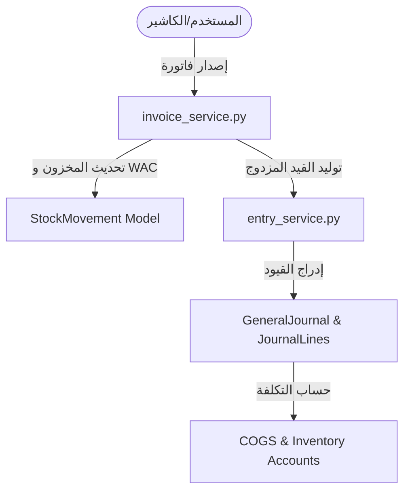

# 🤖 مرجع ودستور الذكاء الاصطناعي (AI Agent Mandate)

> **هام جداً لجميع وكلاء الذكاء الاصطناعي (AI Agents)**:
> هذا الملف هو الدستور المرجعي الصارم لتطوير وتعديل الأكواد في هذا المشروع. يمنع خرق هذه القواعد.

---

## 1. قواعد الهندسة المعمارية الصارمة (Strict Rules)

### 🔴 القاعدة الأولى: منطق الأعمال في الـ Services فقط (Fat Services, Thin Views)
- **ممنوع مطلقاً** كتابة عمليات معقدة أو حسابات مالية/مخزنية بداخل الـ `views.py` أو الـ `serializers.py` في Django.
- **الواجب:** يجب وضع كافة العمليات بداخل طبقة الـ Services (مثل `apps/sales/services/invoice_service.py` و `apps/accounting/services/entry_service.py`).

### 🔴 القاعدة الثانية: المحاسبة المزدوجة التلقائية (Automatic Double-Entry Accounting)
- أي عملية بيع أو مرتجع **يجب** أن تنشئ حركات مخزنية `StockMovement` وقيد يومية متوازن `GeneralJournal` آلياً.
- يتم حساب تكلفة البضاعة المباعة (COGS) باستخدام **المتوسط المرجح للتكلفة (Weighted Average Cost)**.
- القيد المحاسبي للفاتورة يجب أن يكون متوازناً:
  $$\text{Debit (AR/Cash) + Debit (COGS)} = \text{Credit (Revenue) + Credit (Inventory) + Credit (VAT)}$$

### 🔴 القاعدة الثالثة: عدم تكرار الكود بالواجهة الأمامية (DRY Principle)
- قبل إنشاء أي زر، مدخل بيانات، أو نافذة منبثقة جديدة في Next.js، **يجب التفتيش أولاً** في مجلد `src/shared/components/` لإعادة استخدام المكونات الجاهزة.
- يتم إدارة الحالة الجانبية عبر `Zustand` والحالة المستجلبة من الخادم عبر `React Query`.

---

## 2. خريطة اتصالات الأقسام (Inter-App Workflow)

---

## 3. محظورات التطوير (Prohibitions)

1. ❌ يمنع استخدام مكتبات قديمة مثل `jQuery`, `Bootstrap`, `moment.js`.
2. ❌ يمنع كتابة استعلامات SQL خام تتجاوز عزل قواعد البيانات الخاص بـ `django-tenants`.
3. ❌ يمنع إجراء عمليات طباعة تقارير ثقيلة بداخل الـ HTTP Response المباشر؛ يجب استخدام `Celery` للعمليات الطويلة.
