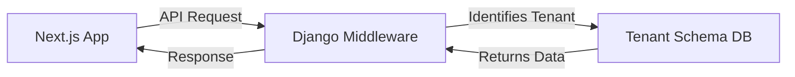

# هيكلية النظام (Architecture) 🏗️

نظام EyeCare مصمم كـ **SaaS Platform** (Software as a Service) يدعم تعدد الشركات في نظام واحد.

## 📐 نظرة عامة
يتكون النظام من جزئين رئيسيين:

1.  **Back-end (Django & DRF)**:
    - يتعامل مع منطق العمل، قواعد البيانات، والعمليات الحسابية.
    - يدعم الـ Multi-tenancy عبر Schemas منفصلة.
    - يوفر واجهة RESTful API.

2.  **Front-end (Next.js)**:
    - يوفر واجهة مستخدم سريعة وعصرية.
    - يتعامل مع الـ State Management عبر Redux/Zustand.
    - يدعم اللغتين العربية والإنجليزية.

## 🔄 تدفق البيانات (Data Flow)

## 📂 توزيع التطبيقات (Apps)
يتم تقسيم الباك آند إلى "Modulized Apps":
- `accounting`: كل ما يتعلق بالحسابات والقيود.
- `crm`: إدارة العملاء والمرضى.
- `inventory`: إدارة المخازن والنظارات والعدسات.
- `sales`: إدارة نقاط البيع (POS) والفواتير.

## 🛡️ الأمان
- **JWT Authentication**: لتأمين الطلبات بين الواجهة والسيرفر.
- **Schema Isolation**: لضمان عدم تداخل بيانات الشركات.
- **Permission System**: نظام صلاحيات دقيق على مستوى الموظف والفرع.
