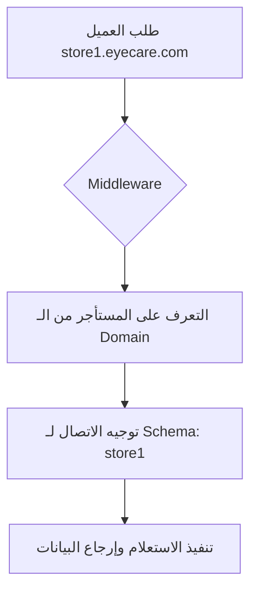

# نظام تعدد المستأجرين (Multi-Tenancy) 🏢

يعتمد نظام EyeCare على استراتيجية **Schema-based Multi-tenancy** باستخدام مكتبة `django-tenants`. هذا يعني أن كل عميل (Brand/Store) يمتلك جدول بيانات معزول تماماً على مستوى قاعدة البيانات.

## 🏗 كيف يعمل النظام؟

يتم تقسيم قاعدة البيانات إلى نوعين من الـ Schemas:

1.  **Public Schema**: تحتوي على البيانات المشتركة بين الجميع (مثل قائمة الدول، اللغات، وبيانات المستأجرين أنفسهم).
2.  **Tenant Schemas**: كل مستأجر له Schema خاصة باسمه تحتوي على بياناته الحساسة (العملاء، المبيعات، المحاسبة).

### مخطط التدفق (Request Flow)



## 🔐 عزل البيانات
يضمن هذا النظام:
- **الأمان**: لا يمكن لمستأجر الوصول لبيانات مستأجر آخر.
- **الأداء**: الاستعلامات تتم في نطاق Schema واحدة مما يحسن السرعة.
- **السهولة**: يمكنك عمل Migration لمستأجر واحد أو للجميع دفعة واحدة.

## 🛠 الأوامر الهامة
لإنشاء مستأجر جديد من الهوية البرمجية:
```bash
python manage.py create_tenant_and_migrate "My Store" "store1"
```
